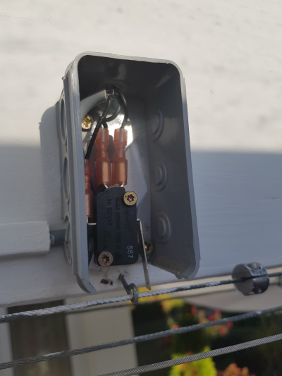
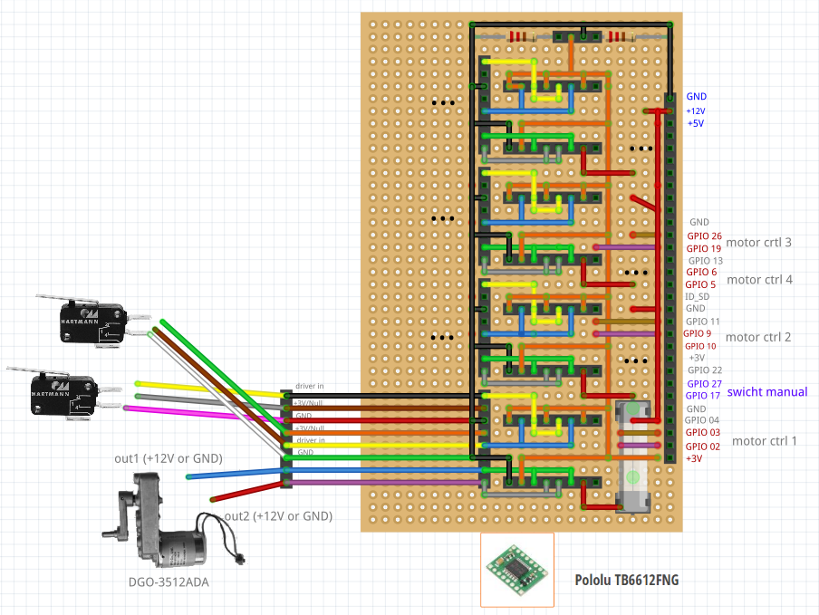

# example hardware setup

Here the setup of a motorized anwing with 4 lanes is descriped

The anwing will be extended and retracted by using a bidirectional DC motor [DGO-3512ADA](https://www.ebay.co.uk/itm/Gear-Motor-Direct-Current-6-12V-Electric-With-Removable-Crank-DGO-3512ADA-/183375290396) motor is used. 
To control the motor the [TB6612FNG](https://www.pololu.com/product/713) dual motor driver is used. 

Extracting and expanding is time-controlled. This means the motor will be supplied with forward or backward power for a period of time. 
To save the motor a limit switch is used which interrupts the power circuit.
 

The motor driver is connected with a Rasperry Pi Zero using the layout as shown below:
 
