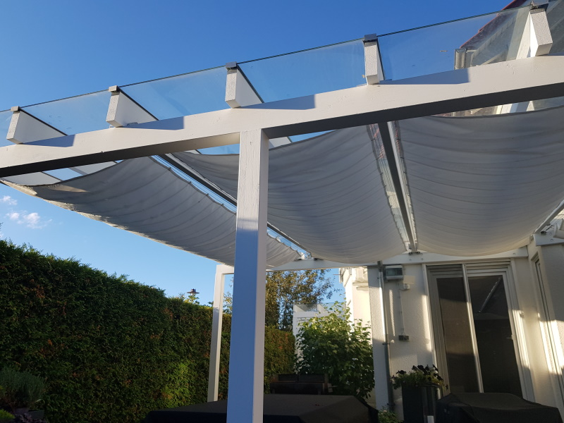

# example hardware setup

Here the construction of a motorized awning with 4 panels is described

The awning is extended and retracted using a bidirectional DC motor [DGO-3512ADA](https://www.ebay.co.uk/itm/Gear-Motor-Direct-Current-6-12V-Electric-With-Removable-Crank-DGO-3512ADA-/183375290396).
The [TB6612FNG](https://www.pololu.com/product/713) dual motor driver is used to control the motor.

The extension and retraction is time controlled. That is, forward or reverse current is supplied to the motor for a specified time.
To protect the motor, a limit switch is used to break the circuit when the end position is reached.

The motor driver is connected to a Rasperry Pi Zero, with the layout as shown below:
 
